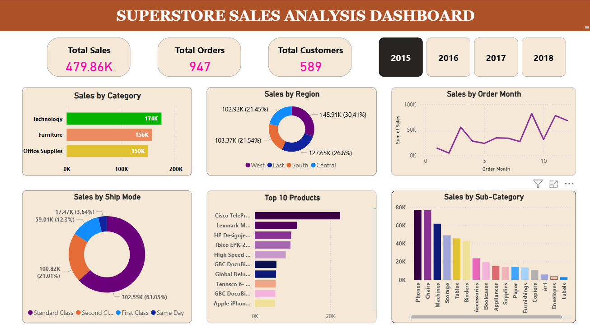
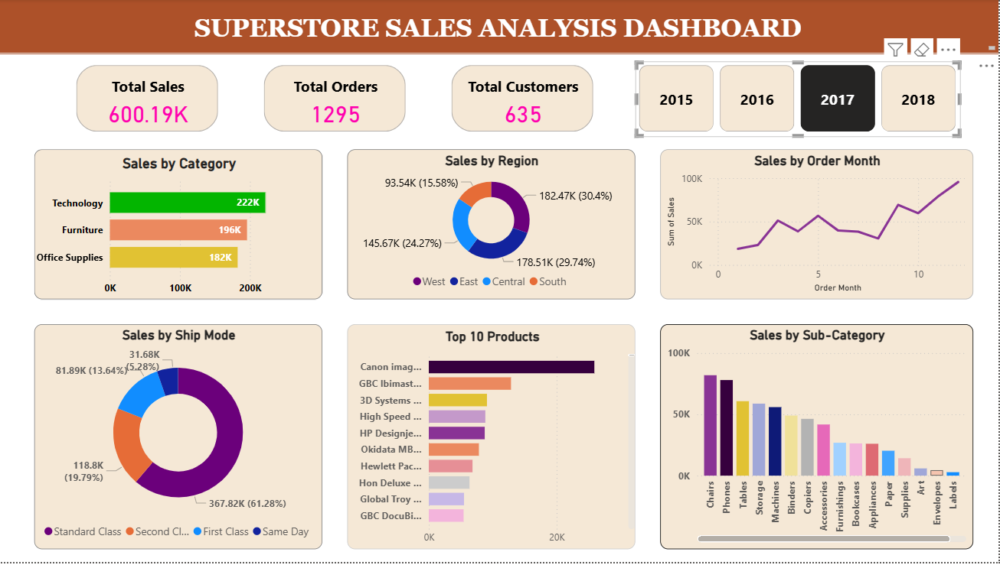

## Superstore Sales Analysis

### Overview
The Superstore Sales Analysis Dashboard is an interactive Power BI project designed to provide deep insights into sales performance across categories, products, regions, and time periods. Using the widely recognized Superstore dataset, this dashboard enables users to explore trends, identify top and bottom-performing products, and analyze customer segments effectively.

### Dashboard

