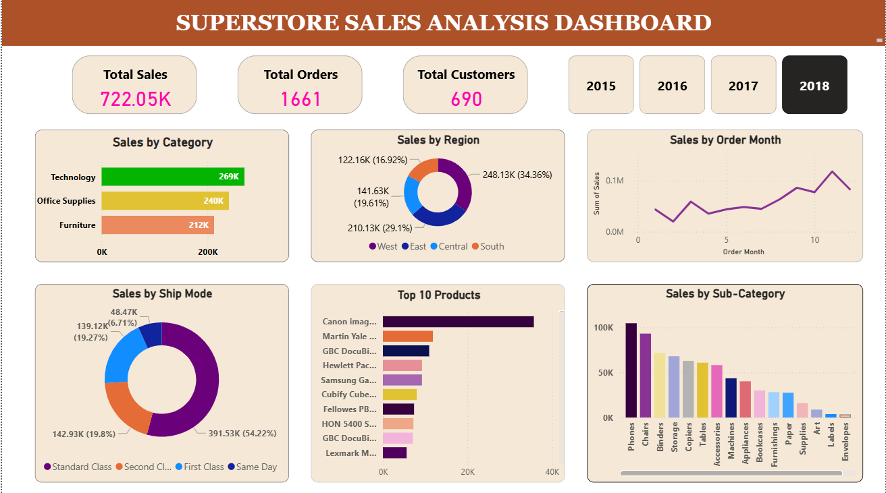

## Superstore Sales Analysis

### Overview
The Superstore Sales Analysis Dashboard is an interactive Power BI project designed to provide deep insights into sales performance across categories, products, regions, and time periods. Using the widely recognized Superstore dataset, this dashboard enables users to explore trends, identify top and bottom-performing products, and analyze customer segments effectively.

### Dashboard

### Insights From the Dataset :
1) Total sales during the period: $2261536.78
2) Yearly trend: Sales increased rapidly over the last 2 years, with peak sales observed in Year 2018.
3) Monthly trend: Certain months like November–December show seasonal spikes, while January-febraury tend to be slow months.
4) Top products by sales: Canon imageCLASS 2200 Advanced Copier, Fellowes PB500 Electric Punch Plastic combo, Cisco TelePresence System EX90 Videoconference contributed the most revenue.
5) Bottom products by sales: Eureka Disposable Bags for Sanitaire Vibra, Avery 5  5.760, Xerox 20 consistently have low sales.
6) Category-wise analysis: Technology category drives the highest sales.Office Supplies and Furniture contribute moderate revenue.
7) Repeat Purchases : 98.36 % of constumers place multiple orders.
8) Customer segments: Consumer segment generates the most sales. Corporate show moderate contribution. Home Office shows lowest contribution.
9) Region-wise sales: West region leads in total sales, followed by East, Central, and South.
10) Sales show clear seasonal spikes during holiday months (Nov–Dec) and slowdowns in off-season months.

### RECOMMENDATIONS :

1) Focus marketing, promotions, and inventory on top-selling products like Canon imageCLASS 2200 Advanced Copier, Fellowes PB500 Electric Punch Plastic combo, and Cisco TelePresence System EX90. Introduce bundle offers or upselling strategies for these high-demand items to maximize revenue.
2) Evaluate underperforming products such as Eureka Disposable Bags, Avery 5 5.760, and Xerox 20 to determine if they should be discontinued, discounted, or repositioned. Investigate if low sales are due to pricing, visibility, or lack of demand.
3) Technology drives the most sales → prioritize stock and marketing efforts in this category. Office Supplies and Furniture contribute moderately → analyze if promotions or product bundling can boost these categories.
4) With 98.36% of customers placing repeat orders, strengthen loyalty programs and targeted marketing campaigns for repeat buyers. Offer incentives for repeat purchases such as discounts, early access to new products, or subscription models.
5) Consumer segment generates most sales → create personalized offers and promotions for this group. Corporate segment shows moderate contribution → consider corporate bundles, bulk discounts, or B2B-focused campaigns. Home Office segment is underperforming → investigate potential product-market fit and marketing strategy.
6) West region leads in sales → maintain strong distribution and marketing in this region. For East, Central, and South, identify top-performing cities or markets and implement targeted promotions to boost revenue.
7) Capitalize on holiday spikes (Nov–Dec) → increase inventory, marketing campaigns, and promotions ahead of peak months. Mitigate off-season slowdowns (Jan–Feb) → introduce sales, discounts, or loyalty campaigns to maintain engagement and revenue.
8) Align inventory levels with seasonal demand patterns and product popularity to reduce overstock or stockouts. Prioritize fast-moving products and adjust procurement for slower-moving items.

